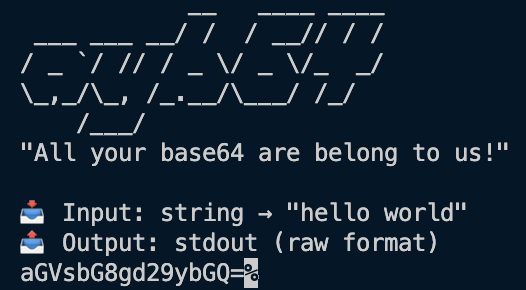

# All Your Base64

> **"All your base64 are belong to us!"**


A modern, efficient, purpose-built CLI utility to convert any possible input file into a base64 string with comprehensive output options. Built with TypeScript and designed for both performance and developer experience.

[](https://badge.fury.io/js/ayb64)
[](https://opensource.org/licenses/MIT)
[](https://github.com/skullzarmy/all-your-base64/actions)



## Quick Navigation

🚀 [Installation](#installation) • 🎯 [Quick Start](#quick-start) • 🤖 [MCP Server](#mcp-server-for-ai-agents) • 📖 [Commands](#commands) • 🎨 [Output Formats](#output-formats) • ⚡ [Advanced Usage](#advanced-usage) • 🔧 [Troubleshooting](#troubleshooting) • 🧪 [API Reference](#api-reference)

## Features

✨ **Modern & Fast** - Built with TypeScript and optimized for performance  
🔍 **Smart Detection** - Industry-leading MIME type detection via [file-type](https://github.com/sindresorhus/file-type) + [mime-types](https://github.com/jshttp/mime-types)  
📁 **Versatile Input** - Files, stdin, strings  
🎨 **Multiple Outputs** - Raw, JSON, JS, TS, CSS, HTML, XML, YAML, Markdown  
🔄 **Bidirectional** - Both encoding and decoding support  
🛡️ **Robust** - Comprehensive error handling and validation  
📊 **Metadata** - File information, hashing, and processing stats  
🎯 **Data URIs** - Generate data URIs with proper MIME types  
🌍 **Cross-Platform** - macOS, Linux, Windows, Docker, Cloud ready

## Why Choose ayb64?

While basic base64 tools simply convert files to strings, **ayb64** provides a complete modern solution:

🎨 **8 Output Formats** - Raw, JSON, JavaScript, TypeScript, CSS, HTML, XML, YAML, Markdown  
🤖 **AI Integration** - Built-in MCP server with memory and job recall for AI workflows  
🔍 **Smart Detection** - Industry-leading MIME type detection (100+ file types)  
📋 **Rich Metadata** - File info, hashing, processing stats, timestamps  
🎯 **Web-Ready** - Generate data URIs for immediate use in web development  
⚡ **Performance** - TypeScript-built with optimized memory usage and benchmarked speed  
🔄 **Versatile Input** - Files, stdin, strings with automatic detection  
🛡️ **Production Ready** - Comprehensive error handling, validation, and testing  
📊 **Developer Experience** - Modern CLI with helpful output and examples

Perfect for developers who need more than just basic file-to-base64 conversion.

## Installation

### Global Installation (Recommended)

```bash
npm install -g ayb64
```

### Local Installation

```bash
npm install ayb64
```

### Using npx (No Installation)

```bash
npx ayb64 --help
# or use the shorter command
npx ayb64 --help
```

## Quick Start

```bash
# Encode a file
ayb64 encode myfile.jpg

# Encode with wrapped output
ayb64 encode myfile.jpg --wrap 76

# Generate data URI
ayb64 encode image.png --data-uri

# Output to file with metadata
ayb64 encode document.pdf -o output.b64 --metadata

# Decode base64 back to file
ayb64 decode SGVsbG8sIFdvcmxkIQ== -o hello.txt

# Pipe from stdin
echo "Hello, World!" | ayb64 encode

# Get file information
ayb64 info myfile.jpg --json
```

## MCP Server for AI Agents

All Your Base64 includes a powerful **Model Context Protocol (MCP) server** optimized for AI agents and coding tasks. The MCP server provides memory, job recall, checksums for change detection, and specialized tools for AI workflows.

### MCP Server Features

🧠 **Smart Memory** - LRU cache with job recall by ID  
🔍 **Change Detection** - SHA256 checksums detect file modifications  
🤖 **AI Optimized** - Tools designed for coding and development workflows  
📋 **Job History** - Track and recall previous encoding operations  
🔗 **Data URIs** - Generate web-ready data URIs for images and assets  
⚡ **Performance** - Lightweight, extensible, and robust

### MCP Server Tools

- **`encode`** - Encode files/data with format options and job tracking
- **`decode`** - Decode base64 with auto-detection and file output
- **`recall`** - Retrieve previous jobs by ID with full context
- **`jobs`** - List recent operations with metadata
- **`datauri`** - Generate data URIs optimized for web development
- **`memory`** - Manage job cache (stats, clear)

### Using the MCP Server

#### Start the MCP Server

```bash
# Using the CLI command (recommended)
ayb64 mcp

# Direct binary
ayb64-mcp

# Development mode
npm run mcp

# Or via npx with source
npx tsx src/mcp-server.ts
```

#### Configure in Your MCP Client

**VS Code/Cursor/Cline** (add to `mcp.json`):

```json
{
  "mcpServers": {
    "ayb64": {
      "command": "ayb64",
      "args": ["mcp"]
    }
  }
}
```

**Claude Desktop**:

```json
{
  "mcpServers": {
    "ayb64": {
      "command": "ayb64-mcp"
    }
  }
}
```

#### Example MCP Workflows

**Encode an image for web use:**

```
Tool: encode
Input: {
  "data": "/path/to/logo.png",
  "isFile": true,
  "format": "js",
  "dataUri": true
}
Output: Job ID + JavaScript const with data URI
```

**Recall a previous job:**

```
Tool: recall
Input: {"jobId": "job_1234567890_abc123"}
Output: Full original result with metadata
```

**Generate data URI for CSS:**

```
Tool: datauri
Input: {"input": "/path/to/background.jpg"}
Output: data:image/jpeg;base64,... (ready for CSS)
```

## Commands

### `encode` / `e`

Convert input to base64 format.

```bash
ayb64 encode [input] [options]
```

**Arguments:**

- `input` - Input file path (use `-` for stdin)

**Options:**

- `-o, --output <path>` - Output file path (default: stdout)
- `-f, --format <format>` - Output format: raw, json, js, ts, css, html, xml, yaml, md
- `-w, --wrap <columns>` - Wrap base64 output at specified column width
- `-d, --data-uri` - Generate data URI with MIME type
- `-m, --metadata` - Include file metadata in output
- `--no-mime` - Disable MIME type detection
- `--quiet` - Suppress non-essential output

### `decode` / `d`

Decode base64 input back to original format.

```bash
ayb64 decode [input] [options]
```

**Arguments:**

- `input` - Input file path or base64 string (use `-` for stdin)

**Options:**

- `-o, --output <path>` - Output file path (default: stdout)
- `-m, --metadata` - Show metadata if available
- `--quiet` - Suppress non-essential output

### `info` / `i`

Display file information and metadata without conversion.

```bash
ayb64 info <input> [options]
```

**Arguments:**

- `input` - Input file path

**Options:**

- `-j, --json` - Output as JSON

### `mcp`

Start the Model Context Protocol server for AI agents.

```bash
ayb64 mcp
```

This command starts the MCP server which provides base64 conversion tools optimized for AI agents and coding workflows. The server includes memory, job recall, checksums, and specialized tools.

**No options** - The MCP server runs as a standalone process communicating via stdio.

### `batch` / `b`

Process multiple files in batch (coming soon).

```bash
ayb64 batch <pattern> [options]
```

## Output Formats

### Raw Format (default)

```bash
ayb64 encode file.txt
# SGVsbG8sIFdvcmxkIQ==
```

### JSON Format

```bash
ayb64 encode file.txt --format json --metadata
```

```json
{
  "data": "SGVsbG8sIFdvcmxkIQ==",
  "size": 22,
  "metadata": {
    "filename": "file.txt",
    "mimeType": "text/plain",
    "size": 13,
    "hash": "abc123...",
    "processingTime": 2
  }
}
```

### JavaScript/TypeScript Module

```bash
ayb64 encode file.txt --format js --metadata
```

```javascript
const base64Data = 'SGVsbG8sIFdvcmxkIQ==';

const metadata = {
  filename: 'file.txt',
  mimeType: 'text/plain',
  size: 13,
};

module.exports = { base64Data, metadata };
```

### Data URI

```bash
ayb64 encode image.png --data-uri
# data:image/png;base64,iVBORw0KGgoAAAANSUhEUgAA...
```

### HTML Document

```bash
ayb64 encode file.txt --format html --metadata
```

```html
<!DOCTYPE html>
<html lang="en">
  <head>
    <meta charset="UTF-8" />
    <title>Base64 Data</title>
  </head>
  <body>
    <div class="base64-data" data-content="SGVsbG8sIFdvcmxkIQ=="></div>
    <div class="metadata">
      <h3>File Information</h3>
      <p><strong>Filename:</strong> file.txt</p>
      <p><strong>MIME Type:</strong> text/plain</p>
      <p><strong>Size:</strong> 13 bytes</p>
    </div>
  </body>
</html>
```

### CSS Custom Properties

```bash
ayb64 encode file.txt --format css
```

```css
.base64-data {
  --base64-content: 'SGVsbG8sIFdvcmxkIQ==';
}

.base64-data::before {
  content: var(--base64-content);
}
```

## Advanced Usage

### Line Wrapping

Wrap base64 output for better readability:

```bash
ayb64 encode file.txt --wrap 64    # 64 characters per line
ayb64 encode file.txt --wrap 76    # RFC 2045 compliant
```

### Processing Multiple Files

```bash
# Using shell globbing
for file in *.jpg; do
  ayb64 encode "$file" -o "${file}.b64"
done

# Using find
find . -name "*.png" -exec ayb64 encode {} -o {}.b64 \;
```

### Piping and Redirection

```bash
# Pipe from curl
curl -s https://example.com/image.jpg | ayb64 encode --data-uri

# Chain operations
ayb64 encode file.txt | ayb64 decode -o restored.txt

# Use with other tools
base64 -d encoded.txt | ayb64 encode --format json
```

## Error Handling

All Your Base64 provides comprehensive error handling with helpful suggestions:

```bash
$ ayb64 encode nonexistent.txt
Error: File not found: nonexistent.txt
Suggestions:
  • Check that the file path is correct
  • Ensure the file exists
  Path: nonexistent.txt
```

Common error types:

- **File not found** - Check file path and permissions
- **Invalid base64** - Verify input format when decoding
- **Permission denied** - Check file/directory permissions
- **Invalid format** - Use `--help` to see supported formats

## API Reference

### File Information Output

When using `--metadata`, you'll get comprehensive file information:

```json
{
  "filename": "example.jpg",
  "mimeType": "image/jpeg",
  "size": 153600,
  "created": "2023-01-01T00:00:00.000Z",
  "modified": "2023-01-02T00:00:00.000Z",
  "hash": "sha256:a1b2c3d4...",
  "processingTime": 15
}
```

### Supported MIME Types

The tool automatically detects file types using the `file-type` package, supporting:

- **Images**: JPEG, PNG, GIF, WebP, SVG, BMP, TIFF, ICO
- **Documents**: PDF, DOC, DOCX, XLS, XLSX, PPT, PPTX
- **Archives**: ZIP, RAR, 7Z, TAR, GZIP, BZIP2
- **Media**: MP4, AVI, MOV, MP3, WAV, OGG, FLAC
- **Text**: Plain text, HTML, CSS, JavaScript, JSON, XML, YAML, Markdown
- **Fonts**: TTF, OTF, WOFF, WOFF2, EOT
- **And many more...**

## Performance

### Benchmarks

| File Size | Time  | Memory    |
| --------- | ----- | --------- |
| 1 KB      | 5ms   | 0 B       |
| 1 MB      | 8ms   | 92.26 KB  |
| 10 MB     | 51ms  | 170.35 KB |
| 100 MB    | 523ms | 257.27 KB |
| 200 MB    | 1.0s  | 447.2 KB  |

_Benchmarks run on real hardware: MacBook Pro, 2.4 GHz 8-Core Intel Core i9, 32GB DDR4, macOS 15.6.1_

**Performance Notes:**

- Memory usage shows peak heap growth during encoding
- Very memory-efficient base64 implementation
- Processing time scales reasonably with file size

_Benchmarks run on real hardware using `npm run benchmark`_

### Optimization Tips

1. **Use raw format** for best performance
2. **Avoid metadata** for simple conversions
3. **Use appropriate wrap settings** for your use case
4. **Process files individually** rather than in large batches

## Configuration

### Environment Variables

- `AYB64_MAX_MEMORY` - Maximum memory usage threshold
- `AYB64_QUIET` - Default quiet mode setting

### Config File

Create `~/.ayb64rc.json` for default settings:

```json
{
  "format": "raw",
  "wrap": 76,
  "metadata": false
}
```

## Integration Examples

### Node.js Scripts

```javascript
const { spawn } = require('child_process');

function encodeFile(filePath) {
  return new Promise((resolve, reject) => {
    const child = spawn('ayb64', ['encode', filePath, '--format', 'json']);
    let output = '';

    child.stdout.on('data', (data) => {
      output += data.toString();
    });

    child.on('close', (code) => {
      if (code === 0) {
        resolve(JSON.parse(output));
      } else {
        reject(new Error(`Process exited with code ${code}`));
      }
    });
  });
}
```

### Web Development

Generate data URIs for CSS:

```bash
ayb64 encode logo.png --data-uri > logo-data.css
```

Create JavaScript modules:

```bash
# Use shell globbing until batch command is implemented
for file in assets/*.png; do
  ayb64 encode "$file" --format js -o "${file%.png}.js"
done
```

### CI/CD Pipelines

```yaml
# GitHub Actions example
- name: Encode assets
  run: |
    for file in dist/assets/*; do
      ayb64 encode "$file" --format json --metadata > "$file.json"
    done
```

## Troubleshooting

### Common Issues

**Q: "Cannot find module 'file-type'"**  
A: Run `npm install` to install dependencies.

**Q: "Permission denied" errors**  
A: Check file permissions: `chmod +r filename` or run with appropriate privileges.

**Q: Output is corrupted**  
A: Ensure proper handling of binary data in your shell/terminal.

### Debug Mode

Set debug environment variable for verbose output:

```bash
DEBUG=ayb64:* ayb64 encode file.txt
```

## Contributing

We welcome contributions! Please see [CONTRIBUTING.md](CONTRIBUTING.md) for guidelines.

### Development Setup

```bash
git clone https://github.com/skullzarmy/all-your-base64.git
cd all-your-base64
npm install
npm run dev
```

### Running Tests

```bash
npm test                # Run all tests
npm run test:coverage   # Run with coverage
npm run test:watch      # Watch mode
```

### Building

```bash
npm run build           # Build TypeScript
npm run lint            # Lint code
npm run format          # Format code
```

## License

MIT © [Joe Peterson](https://github.com/skullzarmy)

## Acknowledgments

### MIME Type Detection Powers

All Your Base64 leverages the incredible work of the open source community for robust file type detection:

🔍 **[file-type](https://github.com/sindresorhus/file-type)** by [Sindre Sorhus](https://github.com/sindresorhus) - The gold standard for detecting file types via magic numbers. This amazing package supports 100+ file types with blazing-fast detection using binary signatures.

📄 **[mime-types](https://github.com/jshttp/mime-types)** by [jshttp](https://github.com/jshttp) - Comprehensive MIME type database with extension mapping. The backbone of web server MIME handling across the Node.js ecosystem.

These packages provide enterprise-grade file detection that would take years to implement and maintain independently. Standing on the shoulders of giants! 🚀

### Open Source Dependencies

This project is built with and grateful for these excellent open source packages:

- **[Commander.js](https://github.com/tj/commander.js)** - The complete solution for Node.js command-line interfaces
- **[TypeScript](https://github.com/microsoft/TypeScript)** - JavaScript with syntax for types
- **[Vitest](https://github.com/vitest-dev/vitest)** - A blazing fast unit test framework powered by Vite
- **[ESLint](https://github.com/eslint/eslint)** - Find and fix problems in JavaScript code
- **[Prettier](https://github.com/prettier/prettier)** - Opinionated code formatter

### Platform Support

All Your Base64 works seamlessly across platforms:

🍎 **macOS** - Native support with proper file system handling  
🐧 **Linux** - Full compatibility across distributions  
🪟 **Windows** - PowerShell, Command Prompt, and WSL support  
📦 **Docker** - Container-ready for CI/CD pipelines  
☁️ **Cloud** - AWS Lambda, Google Cloud Functions, Azure Functions

## Changelog

### v1.0.0

- Initial release
- Core encoding/decoding functionality
- Multiple output formats
- Comprehensive error handling
- Full test coverage

---

**Made with ❤️ and lots of ☕**

_"In the beginning was the bit, and the bit was with base64, and the bit was base64."_
